# GeoSat API — Java REST Backend

API REST do sistema **GeoSat**, plataforma de monitoramento agrícola que combina imagens satelitais (NASA/ESA) com sensores IoT ESP32 para geração de alertas antecipados de risco para produtores rurais brasileiros.

> **FIAP — Global Solution 2026/1 | 2TDS Fevereiro**

> **Professor Orientador:** Marcel Stefan Wagner

---

## 🔗 Links

| Recurso | Link |
|---------|------|
| 🚀 Deploy (produção) | *https://geosat-java.onrender.com* |
| 📖 Swagger UI (produção) | *https://geosat-java.onrender.com/swagger-ui/index.html* |
| 🎥 Vídeo de Apresentação | *https://youtu.be/Pf68a5nJ8_8?si=0yutavGWMHPZ688n* |
| 🎯 Vídeo Pitch (3 min) | **[SUBSTITUIR — link do YouTube após gravação]** |
| 💻 Repositório GitHub | *https://github.com/olavoneves/geosat-java* |

---

## 📐 Diagrama de Entidades

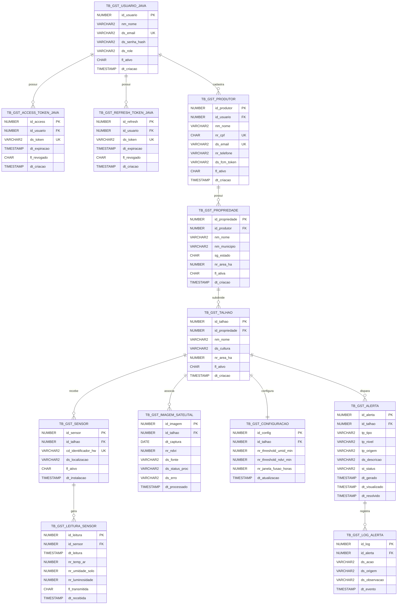

---

## 📊 Diagrama UML — Arquitetura de Classes

```mermaid
classDiagram
    class AuthController {
        +login(LoginRequest) TokenResponse
        +refresh(RefreshTokenRequest) TokenResponse
        +logout(HttpServletRequest) void
        +register(UsuarioRequest) UsuarioResponse
    }

    class AuthService {
        -usuarioRepo UsuarioJavaRepository
        -accessTokenRepo AccessTokenJavaRepository
        -refreshTokenRepo RefreshTokenJavaRepository
        -passwordEncoder BCryptPasswordEncoder
        +login(String email, String senha) TokenResponse
        +refresh(String refreshToken) TokenResponse
        +logout(String accessToken) void
        +register(UsuarioRequest) UsuarioResponse
        -hashToken(String token) String
        -gerarAccessToken(UsuarioJava) String
        -gerarRefreshToken(UsuarioJava) String
    }

    class AuthTokenFilter {
        -usuarioRepo UsuarioJavaRepository
        -accessTokenRepo AccessTokenJavaRepository
        +doFilterInternal(request, response, chain) void
        -extrairToken(request) String
        -hashToken(String token) String
    }

    class ProdutorController {
        +criar(ProdutorRequest, request) EntityModel
        +buscarPorId(Long id) EntityModel
        +buscarMeu(request) EntityModel
        +listarTodos() CollectionModel
        +atualizar(Long id, ProdutorRequest) EntityModel
        +desativar(Long id) void
    }

    class ProdutorService {
        -produtorRepo ProdutorRepository
        +criar(ProdutorRequest, UsuarioJava) ProdutorResponse
        +buscarPorId(Long id) ProdutorResponse
        +buscarPorUsuario(UsuarioJava) ProdutorResponse
        +listarTodos() List~ProdutorResponse~
        +atualizar(Long id, ProdutorRequest) ProdutorResponse
        +desativar(Long id) void
    }

    class GlobalExceptionHandler {
        +handleNotFound(ResourceNotFoundException) ErrorResponse
        +handleBusiness(BusinessException) ErrorResponse
        +handleUnauthorized(UnauthorizedException) ErrorResponse
        +handleForbidden(ForbiddenException) ErrorResponse
        +handleValidation(MethodArgumentNotValidException) ErrorResponse
        +handleConflict(DataIntegrityViolationException) ErrorResponse
        +handleGeneric(Exception) ErrorResponse
    }

    class UsuarioJava {
        -Long idUsuario
        -String nmNome
        -String dsEmail
        -String dsSenhaHash
        -String dsRole
        -Auditoria auditoria
        +getFlAtivo() String
        +getDtCriacao() LocalDateTime
    }

    class Auditoria {
        -String flAtivo
        -LocalDateTime dtCriacao
        +prePersist() void
    }

    class Produtor {
        -Long idProdutor
        -UsuarioJava usuario
        -String nmNome
        -String nrCpf
        -String dsEmail
        -Auditoria auditoria
    }

    class Talhao {
        -Long idTalhao
        -Propriedade propriedade
        -String nmNome
        -String dsCultura
        -Number nrAreaHa
        -Auditoria auditoria
    }

    class Alerta {
        -Long idAlerta
        -Talhao talhao
        -String tpTipo
        -String tpNivel
        -String tpOrigem
        -String stStatus
        -LocalDateTime dtGerado
    }

    AuthController --> AuthService
    ProdutorController --> ProdutorService
    AuthTokenFilter --> UsuarioJavaRepository
    UsuarioJava --> Auditoria
    Produtor --> Auditoria
    Talhao --> Auditoria
    Produtor --> UsuarioJava
    Talhao --> Propriedade
    Alerta --> Talhao
```

---

## 🧪 Evidências de Testes

### Testes via Swagger UI

#### Login e Autenticação
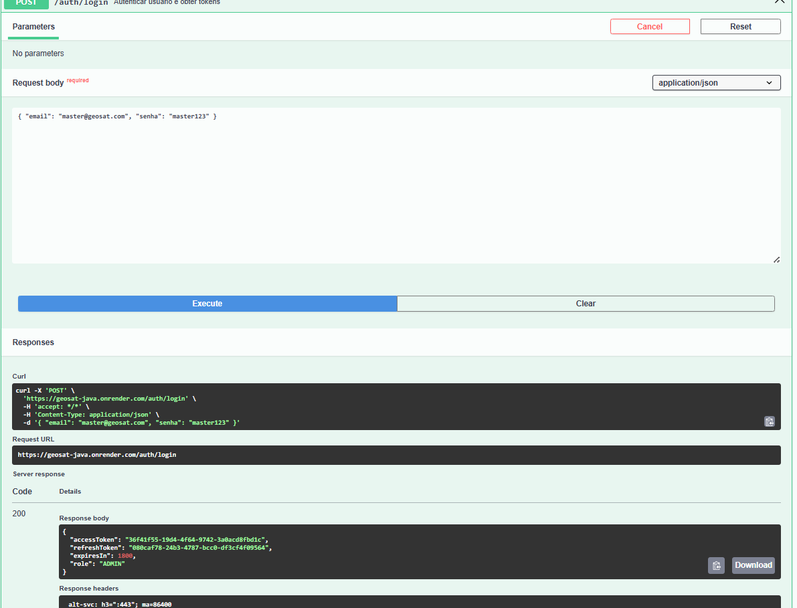

#### Cadastro de Produtor
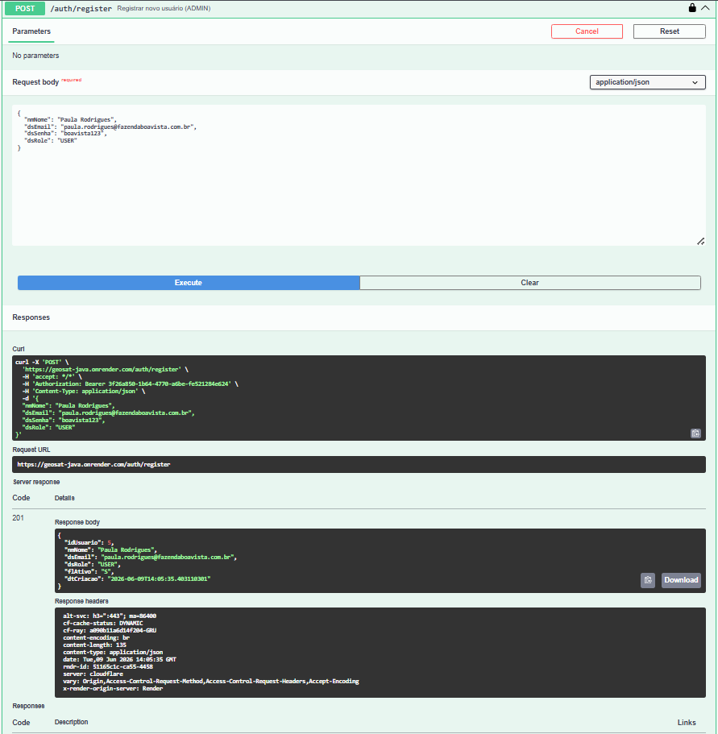

#### Leitura de Sensor e Alerta Automático
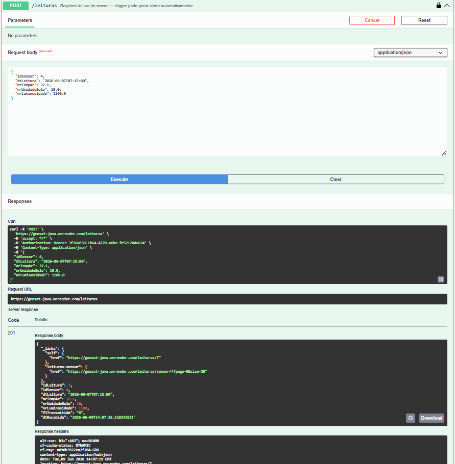
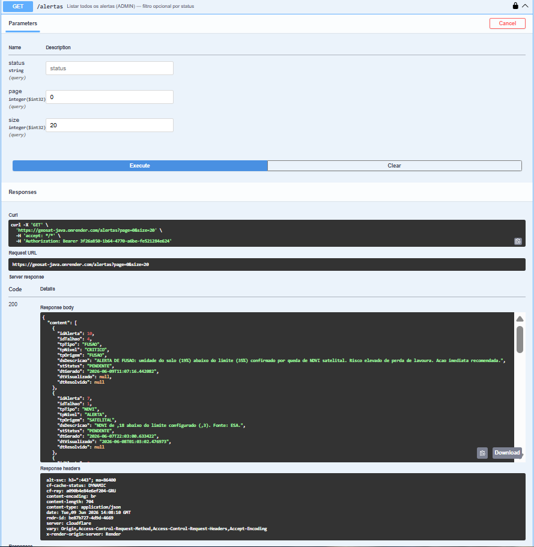

#### Tratamento de Erros (404)
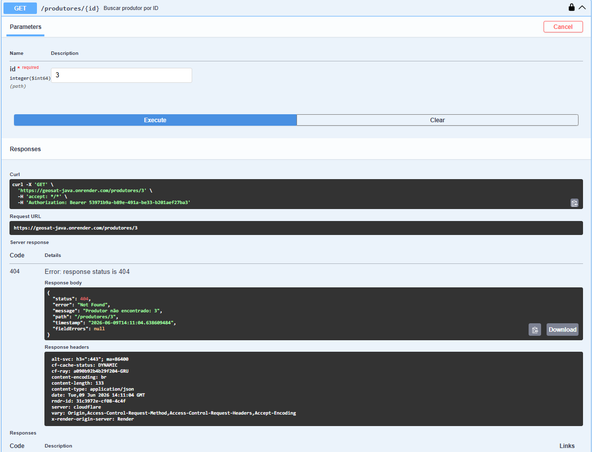

#### Controle de Acesso (403)
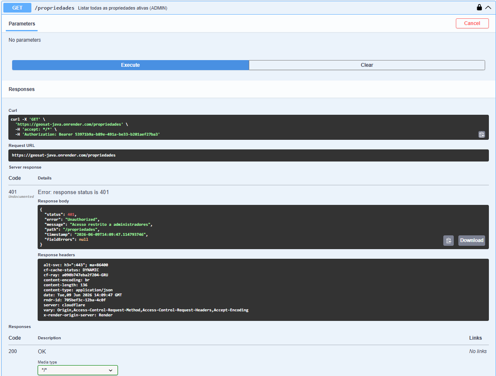

---

### Persistência no Banco Oracle

#### Dados inseridos via API
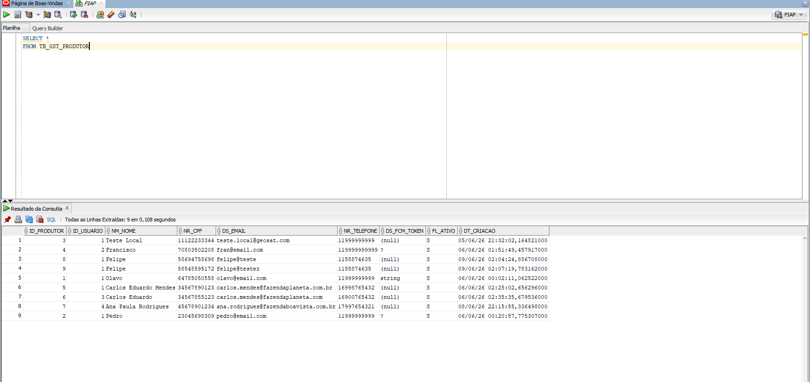
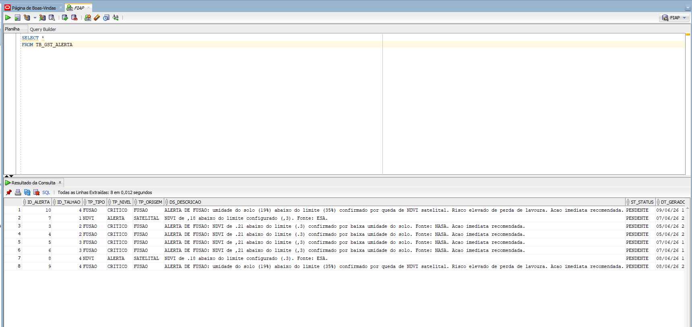

#### Configuração criada automaticamente pelo trigger
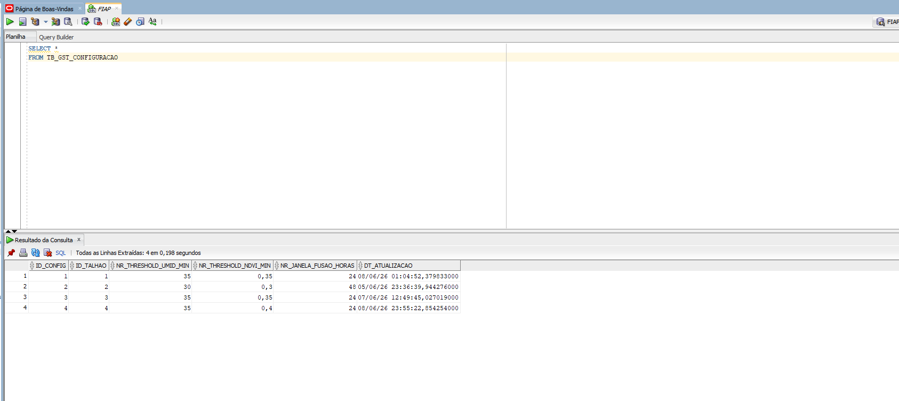

#### Log de auditoria de alerta
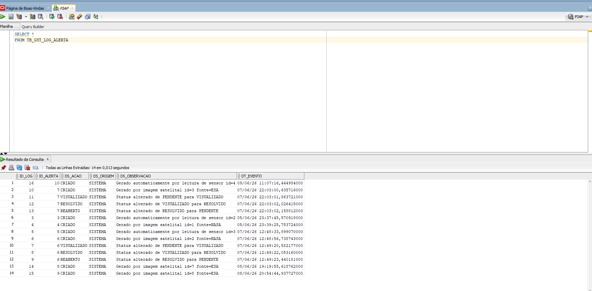

---

## 🏗️ Arquitetura

```
br.com.geosat.server
├── config/          # OpenAPI, CORS, Filter registration, AuthProperties
├── controller/      # REST controllers com HATEOAS e Swagger annotations
├── dto/
│   ├── request/     # Java Records com Bean Validation (@NotBlank, @Email, @Pattern...)
│   └── response/    # Java Records com factory from(Entity)
├── exception/       # Exceções customizadas + GlobalExceptionHandler (@RestControllerAdvice)
├── filter/          # AuthTokenFilter (OncePerRequestFilter) + TokenUtils (SHA-256)
├── model/           # Entidades JPA com @Embedded Auditoria (modelagem avançada)
├── repository/      # Spring Data JPA — JpaRepository
└── service/         # Regras de negócio e orquestração
```

### Modelagem Avançada — @Embedded

A classe `Auditoria` é um `@Embeddable` que encapsula os campos `dtCriacao` e `flAtivo` presentes em múltiplas entidades. Usada com `@Embedded` em `UsuarioJava`, `Produtor`, `Propriedade`, `Talhao` e `Sensor`, demonstrando modelagem avançada com reutilização de componentes JPA.

### Autenticação Manual (sem Spring Security)

- Login gera `accessToken` (UUID) + `refreshToken` (UUID)
- Apenas o **hash SHA-256** de cada token é armazenado no banco
- O plain text é retornado ao cliente: `Authorization: Bearer <token>`
- `AuthTokenFilter` intercepta requisições protegidas, busca hash no banco, valida expiração
- **Refresh token rotation**: ao renovar, o refresh antigo é revogado e dois novos tokens são gerados

---

## 🛠️ Tecnologias

| Tecnologia | Versão |
|------------|--------|
| Java | 21 |
| Spring Boot | 4.0.6 |
| Spring Data JPA + Hibernate | via BOM |
| Spring HATEOAS | via BOM |
| Spring Validation | via BOM |
| Spring Boot DevTools | via BOM |
| Oracle Database (ojdbc11) | via BOM |
| spring-security-crypto (BCrypt) | via BOM |
| SpringDoc OpenAPI / Swagger UI | 2.8.6 |
| Lombok | via BOM |
| Maven | 3.x |

---

## 📋 Endpoints

| Módulo | Base URL | Operações |
|--------|----------|-----------|
| Autenticação | `/auth` | login, refresh, logout, register (ADMIN) |
| Usuários | `/usuarios` | GET, PUT, DELETE (ADMIN) |
| Produtores | `/produtores` | POST, GET, GET/me, PUT, DELETE |
| Propriedades | `/propriedades` | POST, GET, GET/produtor/{id}, PUT, DELETE |
| Talhões | `/talhoes` | POST, GET, GET/propriedade/{id}, PUT, DELETE |
| Sensores | `/sensores` | POST, GET, GET/talhao/{id}, PUT, DELETE |
| Leituras | `/leituras` | POST, GET/{id}, GET/sensor/{id}, GET/sensor/{id}/last |
| Imagens Satelitais | `/imagens` | POST, GET, PATCH/processar, PATCH/erro |
| Alertas | `/alertas` | GET, GET/{id}, GET/talhao, GET/produtor/me, PATCH/visualizar, PATCH/resolver, PATCH/reabrir |
| Configurações | `/configuracoes` | GET/talhao/{id}, PUT/{id} |

Documentação completa interativa: `GET /swagger-ui.html`

---

## ⚙️ Executando Localmente

### Pré-requisitos

- Java 21+
- Maven 3.8+
- Acesso ao banco Oracle GeoSat (schema já criado e populado)

### Variáveis de Ambiente

Crie um arquivo `.env.local` na raiz do projeto (não commitar):

```bash
DB_GST_URL=jdbc:oracle:thin:@<host>:<port>/<service>
DB_GST_USERNAME=<seu_rm>
DB_GST_PASSWORD=<sua_senha>
```

Ou exporte diretamente:

```bash
# Linux/macOS
export DB_GST_URL=jdbc:oracle:thin:@oracle.fiap.com.br:1521:ORCL
export DB_GST_USERNAME=SEU_RM
export DB_GST_PASSWORD=SUA_SENHA

# Windows (PowerShell)
$env:DB_GST_URL = "jdbc:oracle:thin:@oracle.fiap.com.br:1521:ORCL"
$env:DB_GST_USERNAME = "SEU_RM"
$env:DB_GST_PASSWORD = "SUA_SENHA"
```

### Rodando

```bash
./mvnw spring-boot:run
```

Acesse:
- API: `http://localhost:8080`
- Swagger UI: `http://localhost:8080/swagger-ui.html`
- Health check: `http://localhost:8080/actuator/health`

---

## ☁️ Deploy (Render)

1. Faça push do repositório para o GitHub
2. No Render, crie um novo **Web Service** apontando para o repositório
3. Configure o Build Command: `./mvnw package -DskipTests`
4. Configure o Start Command: `java -jar target/*.jar`
5. Em **Environment Variables**, adicione:

| Variável | Valor |
|----------|-------|
| `DB_GST_URL` | `jdbc:oracle:thin:@<host>:<port>/<service>` |
| `DB_GST_USERNAME` | seu RM Oracle |
| `DB_GST_PASSWORD` | sua senha Oracle |

Ou importe o arquivo `.env` diretamente pelo painel do Render.

---

## 🧪 Exemplos de Teste

### 1. Login

```bash
curl -X POST http://localhost:8080/auth/login \
  -H "Content-Type: application/json" \
  -d '{"email": "master@geosat.com", "senha": "master123"}'
```

Resposta:
```json
{
  "accessToken": "uuid-gerado",
  "refreshToken": "uuid-gerado",
  "expiresIn": 1800,
  "role": "ADMIN"
}
```

### 2. Criar Produtor (autenticado)

```bash
curl -X POST http://localhost:8080/produtores \
  -H "Authorization: Bearer <accessToken>" \
  -H "Content-Type: application/json" \
  -d '{
    "nmNome": "João Silva",
    "nrCpf": "12345678901",
    "dsEmail": "joao@fazenda.com",
    "nrTelefone": "11999999999"
  }'
```

### 3. Registrar Leitura de Sensor

```bash
curl -X POST http://localhost:8080/leituras \
  -H "Authorization: Bearer <accessToken>" \
  -H "Content-Type: application/json" \
  -d '{
    "idSensor": 1,
    "dtLeitura": "2026-06-01T10:00:00",
    "nrTempAr": 28.5,
    "nrUmidadeSolo": 25.0,
    "nrLuminosidade": 850.0
  }'
```

> O trigger Oracle verifica automaticamente se `nrUmidadeSolo` está abaixo do threshold configurado para o talhão. Se estiver, um alerta é gerado sem ação adicional da API.

### 4. Consultar Alertas Pendentes

```bash
curl -X GET http://localhost:8080/alertas/produtor/me/pendentes \
  -H "Authorization: Bearer <accessToken>"
```

### 5. Renovar Token

```bash
curl -X POST http://localhost:8080/auth/refresh \
  -H "Content-Type: application/json" \
  -d '{"refreshToken": "<refreshToken>"}'
```

---

## 🗄️ Banco de Dados

O schema Oracle **já existe e está populado**. A API usa `ddl-auto=none` — nunca cria nem altera tabelas.

Os triggers Oracle são responsáveis por:
- Criar `TB_GST_CONFIGURACAO` automaticamente ao inserir um talhão
- Gerar alertas ao inserir leituras com umidade abaixo do threshold
- Gerar alertas ao processar imagem com NDVI abaixo do threshold
- Registrar logs em `TB_GST_LOG_ALERTA` ao mudar status de alerta

### Fluxo de Uso Básico

```
1. POST /auth/login                        → obter tokens
2. POST /auth/register (ADMIN)             → criar usuários
3. POST /produtores                        → cadastrar produtor
4. POST /propriedades                      → cadastrar propriedade
5. POST /talhoes                           → cadastrar talhão (trigger cria configuração)
6. POST /sensores                          → cadastrar sensor ESP32
7. POST /leituras                          → registrar leitura (trigger pode gerar alerta)
8. GET  /alertas/produtor/me/pendentes     → consultar alertas
9. PATCH /alertas/{id}/resolver            → resolver alerta
```

---

## 🐳 DevOps — Execução em Nuvem (Azure)

> Esta seção cobre exclusivamente o ambiente Docker provisionado na Microsoft Azure para a disciplina de DevOps Tools & Cloud Computing.
> O ambiente local e o deploy no Render são descritos nas seções anteriores.

### How To

Este guia descreve o passo a passo completo para provisionar a infraestrutura na Azure, subir os containers Docker, realizar o seed do banco Oracle e validar o ambiente em produção. Siga os passos em ordem.

### Visão geral

Dois containers Docker sobem em uma VM Ubuntu na Azure:

| Container | Imagem | Porta |
|---|---|---|
| `api-geosat-561940` | Dockerfile multi-stage deste repositório | 8080 |
| `oracle-geosat-561940` | `gvenzl/oracle-xe:21-slim` | 1521 |

Ambos executam na rede isolada `geosat-network`. O Oracle usa volume nomeado `oracle-data` para persistência. A API só sobe após o Oracle estar `healthy`.

### Pré-requisitos

- Azure CLI instalado e autenticado (`az login`)
- Git Bash ou terminal Unix-like
- Acesso à subscription Azure for Students

### Passo 1 — Provisionar a VM na Azure

```bash
bash scripts-cli/setup-geosat.sh
```

Cria o Resource Group `rg-geosat-devops` na região North Central US, provisiona a VM `vm-geosat` (Ubuntu 22.04, Standard_B2als_v2, 4 GB RAM), abre as portas 8080 e 1521, instala Docker e ferramentas (Git, nano, curl, wget, htop).

```bash
# Validar infraestrutura (7 verificacoes)
bash scripts-cli/validate-geosat.sh
```

### Passo 2 — Conectar na VM via SSH

```bash
ssh azureuser@<IP_PUBLICO>
# Senha: GeoSat@2026!
```

O IP público é exibido ao final da execução do `setup-geosat.sh`.

### Passo 3 — Clonar o repositório e configurar variáveis

```bash
cd ~
git clone https://github.com/olavoneves/geosat-java.git
cd geosat-java
cp .env.example .env
nano .env
```

Preencha o `.env` com as credenciais do Oracle do container:

```env
# Escopo Oracle
ORACLE_PASSWORD=SuaSenhaOracleAdmin
APP_USER=geosat
APP_USER_PASSWORD=SuaSenhaAppUser
ORACLE_DATABASE=GEOSATDB

# Escopo API Java
DB_GST_URL=jdbc:oracle:thin:@oracle-db:1521/GEOSATDB
DB_GST_USERNAME=geosat
DB_GST_PASSWORD=SuaSenhaAppUser
GEOSAT_AUTH_SECRET=geosat-2026-fiap-secret-key
SPRING_JPA_HIBERNATE_DDL_AUTO=update
```

> ⚠️ **Nunca commite o `.env`** — ele está no `.gitignore`.

### Passo 4 — Subir os containers

```bash
docker compose up -d --build
```

Aguarde o Oracle ficar `healthy` (~2-3 min) e a API inicializar (~30s depois):

```bash
# Acompanhar status
docker compose ps

# Confirmar API no ar
curl http://localhost:8080/actuator/health
```

### Passo 5 — Inserir usuário ADMIN no banco (seed)

O banco Oracle sobe vazio. O usuário master precisa ser inserido antes do primeiro uso da API:

```bash
docker exec -i oracle-geosat-561940 sqlplus geosat/SuaSenhaAppUser@//localhost:1521/GEOSATDB << EOF
INSERT INTO TB_GST_USUARIO_JAVA (
  ID_USUARIO, NM_NOME, DS_EMAIL, DS_SENHA_HASH, DS_ROLE, FL_ATIVO, DT_CRIACAO
) VALUES (
  1, 'Master Admin', 'master@geosat.com',
  '$2b$10$QGgsKq6f1QtCXbuUhB1CvO1Jge9Ke/O8pJIC3xcF2vX9Tx5pQvpEe',
  'ADMIN', 'S', SYSDATE
);
COMMIT;
EXIT;
EOF
```

Credenciais do ADMIN: `master@geosat.com` / `master123`

### Passo 6 — Validar requisitos dos containers

```bash
# Containers rodando em background
docker compose ps

# Usuario nao-root (deve retornar: geosat)
docker exec api-geosat-561940 whoami

# Diretorio de trabalho
docker exec api-geosat-561940 pwd

# Volume nomeado
docker volume ls

# Rede isolada
docker network ls | grep geosat
```

### Passo 7 — Testar CRUD via API

Acesse o Swagger no navegador para testar interativamente:

```
http://<IP_PUBLICO>:8080/swagger-ui.html
```

Ou execute o script de cenas para gravação do vídeo demonstrativo:

```bash
# Cenas de gravacao (executar em sequencia)
bash scenes/c1.sh   # Provisionar infraestrutura
bash scenes/c2.sh   # Clonar, subir containers e seed
bash scenes/c3.sh   # Validar requisitos
bash scenes/c4.sh   # CRUD completo
bash scenes/c5.sh   # Persistencia no Oracle + encerramento
```

### Passo 8 — Evidência de persistência (SQL Developer)

Conecte ao Oracle do container via SQL Developer:

| Campo | Valor |
|---|---|
| Host | `<IP_PUBLICO>` |
| Port | `1521` |
| SID | `GEOSATDB` |
| Usuário | `geosat` |
| Senha | `APP_USER_PASSWORD` do `.env` |

Execute o script `scripts-cli/consulta-evidencia.sql` para evidenciar a persistência em todas as tabelas.

### Passo 9 — Remover recursos (obrigatório após a entrega)

```bash
# Voltar ao Git Bash local (fora da VM)
bash scripts-cli/cleanup-geosat.sh

# Verificar remocao completa
az group show --name rg-geosat-devops --query properties.provisioningState --output tsv
# Quando retornar "not found" = tudo removido
```

> ⚠️ A não remoção gera custos na subscription Azure for Students.

### Diagrama macro da infraestrutura

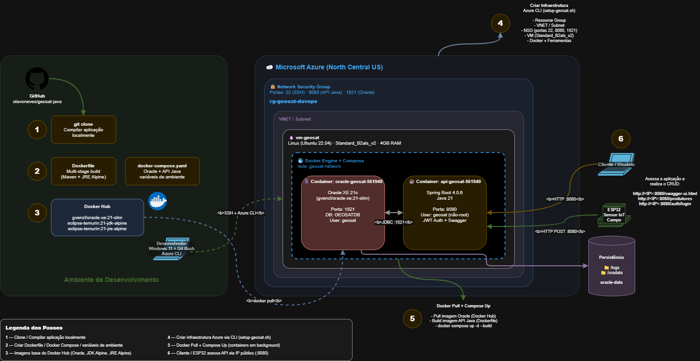

---

## 🌐 Contexto do Sistema GeoSat

O GeoSat é composto por três módulos integrados:

- **Esta API Java** — core da plataforma, consumida pelo app mobile React Native dos produtores rurais
- **API .NET** — painel administrativo para cooperativas e gestores, responsável por processar imagens satelitais
- **ESP32** — sensores IoT instalados nos talhões que enviam leituras periodicamente

Ambas as APIs acessam o mesmo banco Oracle. Os triggers Oracle são o motor central de geração de alertas.

---

*Global Solution 2026/1 | FIAP | 2TDS Fevereiro*
